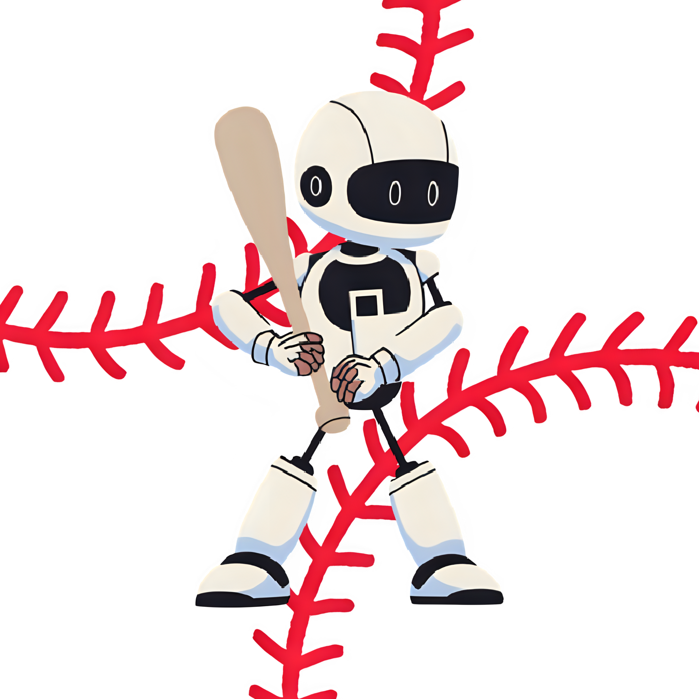

# MLBMatchupXBot

<div align="center">
  
  <br>
  <em>Automated MLB Lineup Cards with Enhanced Statistics</em>
  <br>
  <a href="https://github.com/yourusername/MLBMatchupXBot/releases">
    
  </a>
</div>

An automated X (Twitter) bot that posts daily Major League Baseball (MLB) lineup cards with enhanced statistics and modern design. **Version 2.0** brings improved performance, enhanced image generation, and better automation reliability.

**X Profile**: https://x.com/MLB_Matchup_Bot

**Automation**: Powered by [cron-job.org](https://cron-job.org) and [GitHub Actions](https://github.com/features/actions) for reliable scheduled posting

## 🆕 What's New in Version 2.0

- **Enhanced Image Generation**: Improved lineup card design with better typography and layout
- **Performance Improvements**: Optimized API calls and faster image processing
- **Better Error Handling**: More robust fallback systems and error recovery
- **Improved Automation**: Enhanced reliability with better monitoring and retry logic
- **Code Refactoring**: Cleaner, more maintainable codebase structure

## 🏟️ Features

- **Automated Lineup Detection**: Monitors MLB games for official lineup submissions
- **Enhanced Statistics**: Integrates player stats and team records using pybaseball
- **Modern Design**: Professional lineup cards with team colors and custom fonts
- **Queue System**: Prevents duplicate posts and tracks processed games
- **Modular Architecture**: Clean separation of concerns for maintainability
- **Fallback System**: Mock data support for testing and development

## 🏗️ Project Structure

```
MLBMatchupXBot/
├── MLB_Matchup/
│   ├── src/                           # Core application code
│   │   ├── Main.py                    # Main orchestrator and entry point
│   │   ├── MLBMatchup.py              # Core workflow orchestrator
│   │   ├── game_data_processor.py     # Game data extraction and processing
│   │   ├── game_queue.py              # Queue management and duplicate prevention
│   │   ├── jinja2_image_generator.py  # Modern image generation using Jinja2
│   │   ├── html_to_image_converter.py # HTML to image conversion utility
│   │   ├── image_generator_v2.html    # HTML template for lineup cards
│   │   ├── twitter_image_generator.py # Legacy image generation (deprecated)
│   │   ├── MLB_API_Client.py          # MLB API integration and data fetching
│   │   ├── get_stats.py               # Player statistics and team records
│   │   └── players_previous_games.py  # Player performance history
│   ├── utils/                         # Utility modules (NEW - v2.1)
│   │   ├── api_cache.py               # API caching system (NEW - v2.1)
│   │   ├── date_organizer.py          # Date/file organization and management
│   │   ├── lineup_validator.py        # Lineup validation and verification
│   │   └── get_address.py             # Venue and location information
│   ├── test/                          # Test suite (REORGANIZED - v2.1)
│   │   ├── test_api_optimization.py   # Cache optimization tests (NEW)
│   │   ├── test_historical_date.py    # Historical game tests (NEW)
│   │   ├── test_get_stats.py          # Stats module tests
│   │   ├── test_image_generator.py    # Image generation tests
│   │   └── test_real_game_image.py    # Real game integration tests
│   ├── docs/                          # Documentation (NEW - v2.1)
│   │   ├── API_OPTIMIZATION_SUMMARY.md # v2.1 optimization details
│   │   └── PROJECT_ORGANIZATION.md    # Project structure guide
│   ├── config/
│   │   ├── mock_game_data.py          # Test data for development
│   │   ├── teamPrimaryColors.json     # Team primary color schemes
│   │   ├── teamSecondaryColors.json   # Team secondary colors
│   │   ├── teamAbreviations.json      # Team abbreviations mapping
│   │   ├── teamHashtags.json          # Team hashtags for social media
│   │   ├── teamVenues.json            # Stadium and venue information
│   │   ├── stateAbbreviations.json    # State abbreviation mapping
│   │   └── static/                    # Font files and static assets
│   ├── data/
│   │   ├── processed_games.json       # Queue tracking and processed games
│   │   └── last_processed_date.txt    # Date transition tracking
│   ├── images/                        # Generated lineup cards organized by date
│   └── templates/                     # Image templates and assets
├── Xbot/
│   ├── x_uploader.py                  # Twitter image upload functionality
│   ├── bot.py                         # Twitter API integration
│   └── connectionCheck.py             # Connection verification utility
└── requirements.txt                    # Python dependencies
```

## 🚀 Quick Start

### Prerequisites

- Python 3.8+
- MLB Stats API access
- Twitter API credentials

### Installation

```bash
git clone https://github.com/yourusername/MLBMatchupXBot.git
cd MLBMatchupXBot
pip install -r requirements.txt
```

### Configuration

1. Set up Twitter API credentials in `Xbot/bot.py`
2. Configure MLB API settings in `MLB_Matchup/src/MLB_API_Client.py`
3. Customize team colors and hashtags in `MLB_Matchup/config/`

### Running the Bot

```bash
# Run the main bot
python MLB_Matchup/src/MLBMatchup.py

# Test image generation
python MLB_Matchup/src/test_image_generator.py
```

### Automation Setup

The bot uses multiple automation strategies for reliability:

#### cron-job.org

- **Schedule**: Runs every 15 minutes during MLB season
- **Endpoint**: `https://your-deployment-url.com/trigger`
- **Monitoring**: Email notifications for failures

#### GitHub Actions

- **Schedule**: Runs every 30 minutes via GitHub Actions cron
- **Workflow**: `.github/workflows/mlb-bot.yml`
- **Fallback**: Automatic retry on failures
- **Logs**: Available in GitHub Actions tab

## 🔧 Architecture

### Core Modules

- **Main.py**: Entry point that orchestrates the entire process flow
- **MLBMatchup.py**: Core workflow orchestrator that manages game processing, image generation, and Twitter uploads
- **game_data_processor.py**: Extracts and processes game information from MLB API
- **jinja2_image_generator.py**: Modern image generation system using Jinja2 templates for professional lineup cards
- **html_to_image_converter.py**: Utility for converting HTML templates to high-quality images
- **get_stats.py**: Handles player statistics, team records, and performance data
- **players_previous_games.py**: Manages player performance history and recent game statistics
- **game_queue.py**: Manages processed games to prevent duplicates and track completion status
- **date_organizer.py**: Handles date transitions and organizes generated images by date
- **lineup_validator.py**: Validates lineup data and ensures data integrity
- **MLB_API_Client.py**: Manages MLB API interactions and data fetching

### Key Features

- **Modular Design**: Each component has a single responsibility
- **Error Handling**: Graceful fallbacks for API failures
- **Caching**: Optimized API calls with intelligent caching
- **Testing**: Comprehensive test suite with mock data support

## 📊 Data Sources

- **MLB Stats API**: Game schedules, lineups, and player data
- **pybaseball**: Enhanced player statistics and team records
- **Custom Config**: Team colors, hashtags, and venue information

## 🎨 Image Generation

The bot creates professional lineup cards featuring:

- Team abbreviations with custom fonts
- Player names, positions, and batting order
- Starting pitcher information
- Team records and player statistics
- Venue and game time details
- Team-specific color schemes

## 🔄 Workflow

1. **Date Organization**: Checks for date transitions and organizes existing images by date
2. **Schedule Retrieval**: Fetches today's MLB games from the official API
3. **Queue Management**: Identifies unprocessed games and prevents duplicate processing
4. **Lineup Monitoring**: Continuously checks for official lineup submissions
5. **Data Processing**: Extracts comprehensive game data, player stats, and team records
6. **Image Generation**: Creates professional lineup cards using Jinja2 templates and HTML conversion
7. **Quality Validation**: Ensures lineup data integrity and image quality
8. **Twitter Upload**: Posts generated images with game information and team hashtags
9. **Cache Management**: Clears statistics cache for fresh data on subsequent runs
10. **Status Tracking**: Marks games as processed and maintains processing history

## 🧪 Testing

```bash
# Test with mock data
python MLB_Matchup/src/test_image_generator.py

# Test specific components
python MLB_Matchup/src/debug_team_records.py
```

## 🤝 Contributing

1. Fork the repository
2. Create a feature branch
3. Make your changes
4. Add tests for new functionality
5. Submit a pull request

## 📝 License

If you use or modify this code, please credit the original authors in your documentation, README, or software credits.

This project is licensed under the MIT License - see the LICENSE file for details.

## 🙏 Acknowledgments

- MLB Stats API for game data
- pybaseball library for enhanced statistics
- Twitter API for social media integration
- Custom font designers for professional typography

---

**Note**: This bot is designed for educational and entertainment purposes. Please respect MLB's terms of service and Twitter's API guidelines.
